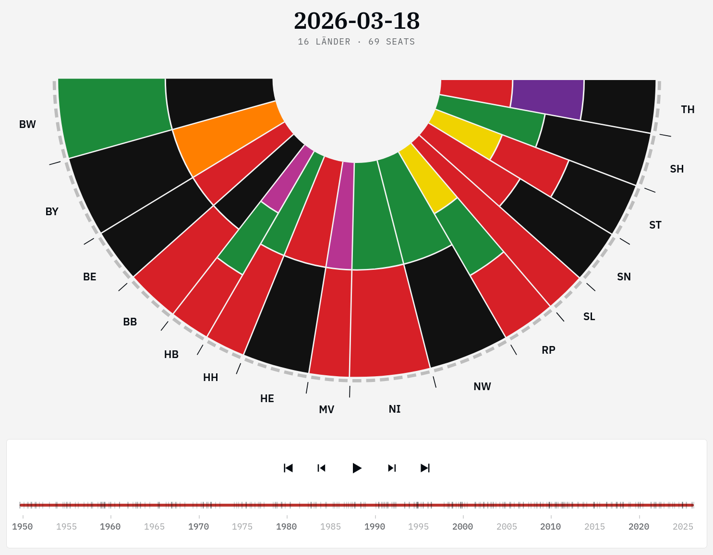

# Bundesrat History Visualization (WIP)



An interactive, browser-based visualization of seat distribution and party power in the German Bundesrat (Federal Council) from 1949 to the present. Live version: https://stgrue.net/bundesrat-history/

## What this is about

The [German Bundesrat](https://en.wikipedia.org/wiki/German_Bundesrat) is a highly unique legislative body. Unlike most upper chambers, it is not directly elected, but rather composed of members of the state governments, who are appointed and recalled by those governments at will. This means the Bundesrat's composition changes continuously as state elections shift the political landscape, rather than at fixed intervals. Furthermore, each state must cast its votes as a bloc (meaning coalition governments must agree on how to vote).
Since the Bundesrat can veto or delay federal legislation, tracking which parties collectively control a majority of seats matters for understanding federal lawmaking.

As I became interested in the history of the Bundesrat, I was disappointed to find that apparently no publicly accessible archive records the full composition going back to its founding in 1949. (If I am wrong about this, please let me know!) The Bundesrat's own [seat distribution gallery](https://www.bundesrat.de/SharedDocs/bilder/DE/galerien/stimmenverteilung-br/zusammensetzung-br.html) only goes back to 1996.

This project is an attempt to remedy that: using AI agents (i.e., [Claude Code](https://code.claude.com/docs/en/overview)) crawling Wikipedia, I created a dataset of every change in state government composition since 1949, along with an interactive visualization to explore it.

> **Note:** This repository is very much a work in progress. There may be bugs in the implementation, as well as errors in the crawled dataset!

## Quickstart

The visualization is a single-page web app with no runtime dependencies — open `index.html` in any modern browser. The data is loaded as a regular `<script src>`, so opening the file directly via `file://` works (no local server required).

```bash
# Either open it directly:
xdg-open index.html       # Linux
open index.html           # macOS

# Or serve it locally if you prefer:
python -m http.server 8000
# then visit http://localhost:8000/
```

### Features

- **Half-circle parliament diagram** — each arc segment is one state, sized by its seat count, with concentric bands for each coalition partner.
- **Timeline scrubber & playback** — drag the timeline, step through changes with arrow keys, or hit Space to play.
- **Hover** — see a state's full coalition, seat count, and the note/source for the current period.
- **Click to pin** — select a state to keep its info panel open and step through *that state's* changes only.
- **Aggregated bloc totals** — running totals of votes per political bloc (Union, SPD, Grüne, …).

## Data

### Source files (`data/history_states/`)

One JSON file per state (e.g. `bw.json`, `by.json`, ...). Each file is a list of change events:

```json
[
  {
    "date": "1949-09-07",
    "parties": ["CDU"],
    "num_seats": 3,
    "note": "First session of the Bundesrat, Kabinett Wohleb III",
    "source": "https://..."
  }
]
```

Fields carry forward: only changed fields need to be listed in subsequent events. A `num_seats: 0` entry marks a state's dissolution.

Covers all 16 modern states plus historical states Baden (`BA`), Württemberg-Baden (`WB`), and Württemberg-Hohenzollern (`WH`).

### Build step (`build.py`)

`build.py` merges all per-state files and writes:

- **`data.js`** — committed, consumed by the page. Compact single-line JSON wrapped as `window.HISTORY_DATA = [...]`.
- **`data/bundesrat_history.json`** — gitignored, verbose/indented, for debugging only.

```bash
python build.py            # regenerate both outputs
python build.py --check    # exit 1 if data.js is out of sync with state JSONs (used in CI)
```

No third-party dependencies — Python 3.10+ stdlib only.

After editing any `data/history_states/*.json`, **run `python build.py` and commit the regenerated `data.js`** along with your edits. The CI `--check` job will fail the PR otherwise.

## Deployment

Deployed via GitHub Pages from `main` using `.github/workflows/deploy.yml`:

- **Pull requests** run `build.py --check` and fail if `data.js` is stale.
- **Pushes to `main`** rebuild `data.js` and publish `index.html`, `app.js`, `styles.css`, `data.js` to Pages.

One-time setup (in the GitHub repo settings): **Settings → Pages → Source: GitHub Actions**.
