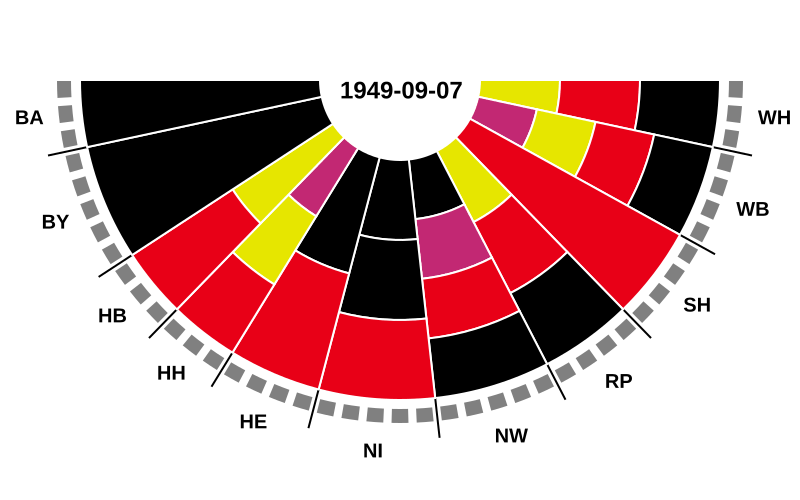

# Bundesrat History Visualization (WIP)



Visualizing seat distribution and party power in the German Bundesrat (Federal Council) from 1949 to the present.

## What this is about

The [German Bundesrat](https://en.wikipedia.org/wiki/German_Bundesrat) is a highly unique legislative body. Unlike most upper chambers, it is not directly elected, but rather composed of members of the state governments, who are appointed and recalled by those governments at will. This means the Bundesrat's composition changes continuously as state elections shift the political landscape, rather than at fixed intervals. Furthermore, each state must cast its votes as a bloc (meaning coalition governments must agree on how to vote).
Since the Bundesrat can veto or delay federal legislation, tracking which parties collectively control a majority of seats matters for understanding federal lawmaking.

As I became interested in the history of the Bundesrat, I was disappointed to find that apparently no publicly accessible archive records the full composition going back to its founding in 1949. (If I am wrong about this, please let me know!) The Bundesrat's own [seat distribution gallery](https://www.bundesrat.de/SharedDocs/bilder/DE/galerien/stimmenverteilung-br/zusammensetzung-br.html) only goes back to 1996.

This project is an attempt to remedy that: Using AI agents (i.e., [Claude Code](https://code.claude.com/docs/en/overview)) crawling Wikipedia, I created a dataset of every change in state government composition since 1949, along with tools to visualize it.

> **Note:** This repository is very much a work in progress. There may be bugs in the implementation, as well as errors in the crawled dataset!

## Installation & Quickstart

(Note: These instructions assume you are using [uv](https://docs.astral.sh/uv/).)

```bash
# 1. Create and activate a virtual environment
uv venv
source .venv/bin/activate

# 2. Install dependencies
uv pip install pycairo cairosvg pillow matplotlib

# 3. Merge state data
python merge_history.py

# 4. Render SVGs
python main.py

# 5. Build animated GIF
python make_gif.py
```


## Data

### Source files (`data/history_states/`)

One JSON file per state (e.g. `bw.json`, `by.json`, ...). Each file is a list of change events:

```json
[
  {
    "date": "1949-09-07",
    "parties": ["CDU"],
    "num_seats": 3,
    "note": "First session of the Bundesrat, Kabinett Wohleb III",
    "source": "https://..."
  }
]
```

Fields carry forward: only changed fields need to be listed in subsequent events. A `num_seats: 0` entry marks a state's dissolution.

Covers all 16 modern states plus historical states Baden (`BA`), Württemberg-Baden (`WB`), and Württemberg-Hohenzollern (`WH`).

### Merge step (`merge_history.py`)

Combines all per-state files into a single chronological `data/bundesrat_history.json`. Each entry represents a date where at least one state changed; unchanged states are included with `"note": "/unchanged"` for completeness.


## Visualizations

### Semicircle parliament diagram (`main.py`)

Renders one SVG per time point showing the Bundesrat's composition as a half-circle diagram:

- Each arc segment represents one state, sized proportionally to its seat count
- Arc segments are subdivided radially by governing coalition party, each party band colored by affiliation
- State abbreviations are labeled around the outside
- The current date is displayed in the center
- States are arranged in alphabetical order of their actual names (NOT their abbreviations, i.e., "HB"/"Bremen" starts with a "B")

Outputs to `output/br0.svg`, `output/br1.svg`, …

### Animated GIF (`make_gif.py`)

Converts the SVG series into a single animated GIF (`output/bundesrat_animation.gif`), scaled to fit ~20 seconds of animation at even frame duration.
